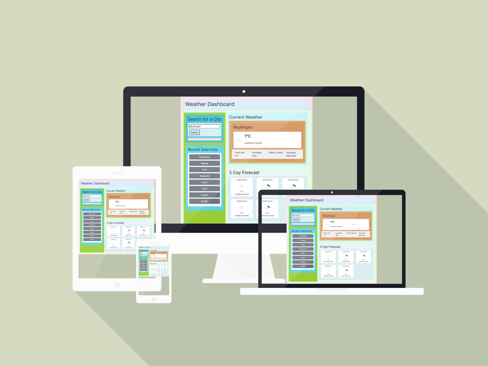

# 🌤️ Weather Dashboard

## 📱 Responsive Mockup

🌍 View the live project here 👉 https://zsolt68.github.io/weather-dashboard-pp2/

A responsive, interactive weather application that allows users to search for any city and instantly view current weather conditions along with a 5‑day forecast. This project demonstrates API integration, DOM manipulation, responsive UI design, and clean JavaScript logic. It was developed as part of the Code Institute Portfolio Project 2. Built with HTML, CSS, JavaScript, Bootstrap, and the OpenWeather API.

By Zsolt Földes.

---
# 📝 Professional Introduction

This Weather Dashboard was created for the Code Institute’s Portfolio Project 2 (JavaScript Essentials). The goal of the project was to build a dynamic, user‑driven application that consumes a public API, updates the DOM in real time, and provides a clean, intuitive user experience. The project showcases my ability to write modular JavaScript, handle asynchronous API calls, manage localStorage, and design a responsive interface suitable for all device sizes.

## 📁 Project Structure

weather-dashboard/
│
├── index.html
├── style.css
├── script.js
├── test.md
└── README.md

- **index.html** — Main application page using Bootstrap and CSS for layout.  
- **style.css** — Custom styling layered on top of Bootstrap.  
- **script.js** — API calls, DOM manipulation, forecast rendering, and error handling.  
- **test.md** — Manual and automatic testing using W3C Validator, Jigsaw, Lighthouse and JSHint.  
- **README.md** — Documentation for deployment, features, and testing.

---

## 🚀 Wireframe

+--------------------------------------------------------------+
|                        WEATHER DASHBOARD                     |
+--------------------------------------------------------------+

|--------------------------------------------------------------|
| LEFT COLUMN (Search + History)        | RIGHT COLUMN (Weather)|
|--------------------------------------------------------------|

LEFT COLUMN (approx. 30–35% width)
----------------------------------
[ Search for a City ]
+--------------------------------------------------+
| [ Enter city name......................... ] [Go] |
+--------------------------------------------------+

[ Error / Info Message (hidden by default) ]

Recent Searches:
+---------------------------+
| • Dublin                  |
| • London                  |
| • Paris                   |
| • Budapest |
| • Ballinteer|
| • Reutlingen|
| • Corfu|
| • Ballinteer|

+---------------------------+

RIGHT COLUMN (approx. 65–70% width)
-----------------------------------

CURRENT WEATHER
+--------------------------------------------------------------+
| City Name (e.g., Dublin)                                     |
| Date (e.g., Tue, 9 Mar 2026)                                |
|                                                              |
|   [Weather Icon]   12°C                                      |
|                     Light rain                               |
|                                                              |
|  Feels like: 12°C   Humidity: 82%   Wind: 5 m/s   Pressure: 1012 hPa|
+--------------------------------------------------------------+

5‑DAY FORECAST
+--------------------------------------------------------------+
|  [Card]   [Card]   [Card]   [Card]   [Card]                  |
|                                                              |
|  +-------+  +-------+  +-------+  +-------+  +-------+       |
|  |  Date  | |  Date  | |  Date  | |  Date  | |  Date  |       |
|  |  Icon |  | Icon |  |  Icon |   |  Icon |   |  Icon |       |
|  |  11°C |  |  13°C |  |  10°C |  |  12°C |  |  14°C |       |
|  |forecast desc| |forecast desc| |forecast desc| 
|  |forecast desc | |forecast desc|       
|  +-------+  +-------+  +-------+  +-------+  +-------+       |
+--------------------------------------------------------------+

## Divs structure in this project

+--------------------------------------------------------------+
<! -- Outer page wrapper-->
| 
                                      |
| <!-- Header section -->                                      
|   <header>                                                   |
|     <h1>Weather Dashboard</h1>                               |
|   </header>                                                  |
| <!-- MAIN GRID (LEFT + RIGHT COLUMNS) -->
|<main class="row">                                         |   
|     <!-- LEFT COLUMN -->                                     |
|     
 
               <!-- SEARCH SECTION -->            |                                                   
|       <section id="search-section">                          |
|         <h2>Search for a City</h2>                           |
|            <!-- Search form -->                               
|         <form id="search-form">                              |
|           <input id="city-input">                            |
|           <button id="search-btn">Search</button>            |
|         </form>

<!-- SEARCH MESSAGE (errors, info, etc.) -->
|

                      |
|       </section>                                             |
|<!-- SEARCH HISTORY SECTION -->                                
|       <section id="history-section">                         |
|         <h3>Recent Searches</h3>
 <!-- LIST WHERE JS WILL INSERT HISTORY BUTTONS -->
|         <ul id="history-list"></ul>                          |
|       </section>                                              

  <!-- END LEFT COLUMN -- >                               
|     <!-- RIGHT COLUMN -->                                    |
|     
                            |
| 
<!-- CURRENT WEATHER SECTION -->
|<section id="current-weather">                         |
|         <h2>Current Weather</h2>                             |
|
<!-- CURRENT WEATHER CARD -->
|         
         |
|           
                            |
|    <!-- CITY NAME -->
 <h3 id="current-city">City Name</h3>
<!-- DATE -->
|             
Date
                    |

| <!-- MAIN WEATHER ROW (ICON + TEMP + DESCRIPTION) -->
|             
           |
|                                       |
|               
                                          |
|                 
12°C
                |
|                 
Sunny
        
|               
                                         |
|             
                                           |
| <!-- WEATHER DETAILS GRID -->
|             
           |
|               
                              |
|                 Feels like:                     |
|                 12°C    |
|               
                                         |
|               
                              |
|                 Humidity:                       |
|                 82%       
|               
                                         |
|               
                              |
|                 Wind:                           |
|                 5m/s          |
|               
                                         |
|               
                              |
|                 Pressure:                       |
|                 1012 hPa  |
|               
                                         |
|             
                                           |
|                                                              |
|           
                                             |
|         
                                               |
|  <!-- EMPTY STATE MESSAGE -->                                                          
|         
 Search for a city to see the weather.

                           |
|       </section>                                            |
|<!-- FORECAST -->                                      |
|       <section id="forecast">                                |
|         <h2>5-Day Forecast</h2>
<!-- FORECAST CARDS ROW -->
|         
                |
|           <!-- JS injects 5 cards here -->  

Day 1

Day 2

Day 3

Day 4

Day 5

|
 |
|<!-- EMPTY STATE MESSAGE -->                                   
|         
Forecast will appear here.

|       </section>                                             |
|                                                              |
|     
  <!-- END RIGHT COLUMN -->                        |
|                                                              |
|   </main>                                                    |
|                                                              |
| 
 <!-- END PAGE WRAPPER -->
                                                               |
+--------------------------------------------------------------+

## 🚀 Features

- **City Search** — Enter any city name to retrieve live weather data.  
- **Current Weather Display** — Temperature, conditions, humidity, wind speed, and weather icon.  
- **5‑Day Forecast** — Automatically generated forecast cards using OpenWeather’s forecast API.  
- **Responsive Layout** — Built with Bootstrap, CSS, JS for mobile‑first responsiveness.  
- **Error Handling** — Clear feedback for invalid city names or network issues.  
- **Clean UI** — Modern, minimal design with custom CSS enhancements.

---

## 🛠️ Technologies Used

- HTML5  
- CSS3  
- Bootstrap 5  
- JavaScript (ES6+)  
- OpenWeather API: https://home.openweathermap.org/
- Google Fonts (Inter)

---

## 🌐 Live Demo

Add your deployed link here once hosted on GitHub Pages:

https://yourusername.github.io/weather-dashboard/
---

## 🔧 How It Works

1. User enters a city name.  
2. JavaScript sends a request to the **OpenWeather Current Weather API**.  
3. If successful, the UI updates with:  
   - City name  
   - Temperature (°C)  
   - Weather description  
   - Humidity  
   - Wind speed  
   - Weather icon  
4. A second request retrieves the **5‑day forecast**, which is displayed as cards.  
5. Errors (e.g., invalid city) are handled gracefully.

---

## 📸 Screenshots

Add screenshots here once your UI is ready:

assets/images/screenshot-home.png
assets/images/screenshot-forecast.png

---

## 🧪 Testing

- Tested on Chrome, Firefox, and Edge.  
- Verified responsive behaviour on mobile, tablet, and desktop.  
- Tested error handling with invalid city names.  
- Verified API responses and DOM updates.

---

## 📦 Deployment

To deploy using GitHub Pages:

1. Push your project to a GitHub repository.  
2. Go to **Settings → Pages**.  
3. Select the `main` branch and `/root` folder.  
4. Save and wait for the deployment link.

---

## 📝 Future Enhancements

- Search history saved in localStorage  
- Dark mode toggle  
- Geolocation support (“Use my location”)  
- Custom weather icons  
- Animated backgrounds based on weather conditions  

---

## 🙌 Credits

- OpenWeather API  
- Bootstrap  
- Google Fonts  
